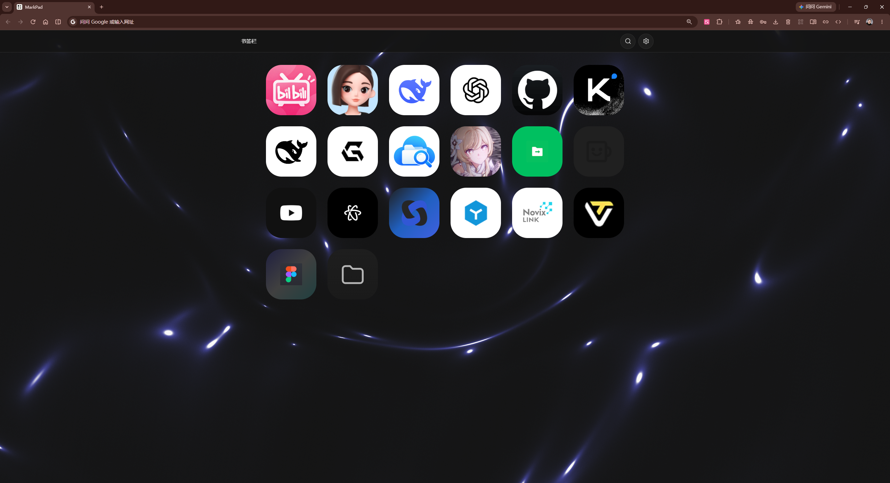

#  MarkPad

面向触控操作的 Chrome 新标签页书签面板：把现有 Chrome 书签直接排成可点击、可整理的方形卡片。

适合在触控屏、平板式 PC 或桌面浏览器上，用更大的操作目标访问和整理常用书签。MarkPad 直接读写 Chrome 原生书签，不创建第二套书签库，因此不需要导入、同步或迁移。

`v0.3.1` · Chrome Extension Manifest V3

[安装](#安装) · [使用方式](#使用方式) · [快捷键](#快捷键) · [权限与数据](#权限与数据) · [开发与验证](#开发与验证)

## 预览

真实运行画面展示深色主题下的书签卡片网格与背景光效。卡片默认以图标为主；鼠标悬停或键盘聚焦时，标题与地址会在卡片内展开。触控或手写笔第一次点按先查看名称，第二次点按才打开入口。



## 安装

前提：使用桌面版 Chrome，并已下载或克隆本仓库。

1. 在地址栏打开 `chrome://extensions/`。
2. 开启页面右上角的「开发者模式」。
3. 点击「加载已解压的扩展程序」，选择本仓库根目录。
4. 打开一个新标签页，MarkPad 会替换默认新标签页。

修改源码后，回到扩展管理页点击该扩展的刷新按钮，再打开新标签页查看效果。

## 使用方式

| 场景 | 可以做什么 |
| --- | --- |
| 浏览与整理 | 进入文件夹、使用面包屑或浏览器返回键回退；新建、编辑、移动、删除书签和文件夹，并用拖拽调整顺序。 |
| 触控与键鼠 | 点击打开、右键或长按打开操作菜单；支持方向键导航、键盘编辑与 `Ctrl+Click` 多选。主要触控目标不小于 44px。 |
| 查找入口 | 按 `/` 或 `Ctrl+F` 搜索全部书签和文件夹。 |
| 管理图标 | 上传 SVG、PNG/APNG、GIF、JPG 或 WebP；可调整原样、自动融合、黑、白或自定义背景，以及 40%–400% 图标缩放。 |
| 自动网站图标 | 卡片可见时按需读取网站声明的图标；结果按完整书签地址缓存，只有在右键菜单选择「图标：重新获取网站图标」时才会再次请求。 |
| 调整外观 | 切换浅色或深色主题，调整卡片尺寸、圆角、页面留白、卡片间距、文字、顶部栏背景，以及背景光效的开关和强度。 |

上传的位图原始尺寸需至少为 256×256。静态图片上限为 1 MB；GIF、APNG、动态 WebP 和 SVG 动画上限为 10 MB，并保留原始动画。

背景光效使用原生 WebGL2。页面不可见时会暂停；系统偏好减少动效时只绘制静态画面；设备不支持 WebGL2 时，页面保持纯色背景。

## 快捷键

| 按键或手势 | 操作 |
| --- | --- |
| 点击 / 触控 | 打开书签或进入文件夹；触控首次点按卡片会展开文字 |
| 右键 / 长按 | 打开卡片操作菜单 |
| `N` / `Shift+N` | 新建书签 / 新建文件夹 |
| `/` / `Ctrl+F` | 搜索书签和文件夹 |
| `Backspace` / `Alt+←` | 返回上级 |
| `↑` `↓` `←` `→` | 在卡片间移动焦点 |
| `Enter` / `F2` / `Delete` | 打开 / 编辑 / 删除当前卡片 |
| `Ctrl+Click` | 多选卡片 |
| `=` / `-` | 放大 / 缩小卡片 |
| `Escape` | 关闭弹窗、搜索或工具菜单 |

## 权限与数据

| 权限 | 用途 |
| --- | --- |
| `bookmarks` | 读取、创建、编辑、移动、删除 Chrome 原生书签。 |
| `storage` | 保存本地外观偏好、自定义图标和网站图标缓存。 |
| `tabs` | 根据用户设置在新标签页或当前标签页打开书签。 |
| `<all_urls>` | 当对应书签卡片可见时，读取该网站声明的图标和图标资源；不会在启动时批量访问网站。 |

MarkPad 不维护独立的书签副本。对书签或文件夹的编辑、移动和删除会直接作用于 Chrome 书签；删除操作会先要求确认，文件夹还会显示其子项数量。

## 版本

当前版本：`0.3.1`。这一版支持按书签缩放图标，优化网站图标缓存和新标签页图标，并放宽动态图上传限制；完整记录见 [完整变更记录](CHANGELOG.md)。

## 开发与验证

扩展运行时只使用原生 JavaScript、模块化 CSS 与 Manifest V3，没有构建步骤。Node.js 仅用于安装开发依赖、运行测试和重新生成内置 GSAP 文件。

```powershell
npm ci
npm test
node --check main.js
node --test tests\version-system.test.mjs
npm run vendor:gsap
node -e "JSON.parse(require('fs').readFileSync('manifest.json', 'utf8'))"
git diff --check
```

`npm run vendor:gsap` 仅在升级 `gsap` 开发依赖后使用。涉及触控、弹窗、拖拽、图标工坊或 Chrome API 的改动，还需在 `chrome://extensions/` 刷新扩展后验证。

```text
MarkPad/
├── components/       UI 组件
├── core/             书签数据、路由、事件与图标解析
├── css/              样式入口与模块
├── docs/             产品与交互说明
├── tests/            Node 行为测试
├── index.html        新标签页入口
├── main.js           应用装配与全局交互
└── manifest.json     扩展清单与安装版本号
```

维护边界、模块职责与运行态验证要求见 [AGENTS.md](AGENTS.md)。
