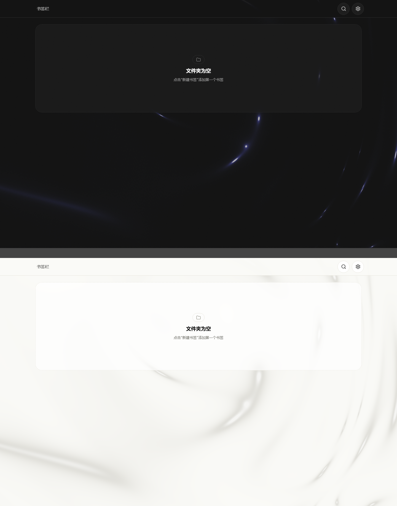

# MarkPad

Chrome 新标签页书签面板

把 Chrome 书签换成适合触控、鼠标和键盘操作的卡片网格。

[功能](#功能) · [界面](#界面) · [安装](#安装) · [快捷键](#快捷键) · [权限](#权限) · [开发](#开发)

---

## 简介

MarkPad 替换 Chrome 的新标签页，直接读取和修改 Chrome 原生书签。书签和文件夹以方形卡片展示，适合远程平板、触控屏，也不妨碍用鼠标和键盘快速操作。没有第二套书签库，不需要导入、同步或迁移。

<p align="center">
  
</p>

---

## 功能

功能 | 说明
--- | ---
书签与文件夹 | 新建、编辑、移动、删除、拖拽排序；文件夹可逐层进入，面包屑和浏览器返回键都能回退。
卡片操作 | 卡片保持方形，标题和域名在悬停或键盘聚焦时显示；触屏首次点按先看名称，再点一次打开。
多种输入 | 支持鼠标右键、触控长按、键盘方向键、快捷键和 Ctrl+点击多选；主要触控目标不小于 44px。
图标 | 用户可上传动态 SVG、PNG/APNG、GIF、JPG 或 WebP，保留原始动画；背景可选原样、自动融合、黑、白或自定义色。默认按名称匹配内置图标库，未命中时按需显示网站声明资源，网站图标也可独立设置同一背景策略。
搜索 | 用 `/` 或 `Ctrl+F` 搜索全部书签和文件夹。
外观 | 浅色、深色两种主题；可调整卡片大小、圆角、容器边距、卡片间距、字体与文字参数、顶部栏背景强度，以及背景光效开关和强度。
背景光效 | 基于原生 WebGL2；页面不可见时暂停，系统要求减少动效时只绘制静态画面，WebGL2 不可用时保留纯色背景。

---

## 界面

卡片默认只显示图标。需要确认入口时，把鼠标移上去或用键盘聚焦；文字面板覆盖在卡片内，不会挤动网格。以下图片使用隔离的测试书签，不包含真实书签数据。

<p align="center">
  
</p>

背景光效可单独关闭，和书签内容无关。

<p align="center">
  
</p>

图标工坊只提供内置候选和文件上传。内置库初始为空，后续随版本人工筛选加入；自动匹配只读取书签名称。网站图标仅在卡片显示时解析 `icon`、Apple Touch、Manifest 或同源 favicon，不做启动批量请求。

---

## 安装

1. 下载或克隆本仓库。
2. 在 Chrome 打开 `chrome://extensions/`。
3. 开启右上角的「开发者模式」。
4. 点击「加载已解压的扩展程序」，选择仓库根目录。
5. 打开一个新标签页。

修改代码后，在扩展管理页点击刷新即可生效。

---

## 快捷键

按键或手势 | 操作
--- | ---
点击 / 触控 | 打开书签或进入文件夹
右键 / 长按 | 打开卡片操作菜单
`N` / `Shift+N` | 新建书签 / 文件夹
`/` / `Ctrl+F` | 搜索书签和文件夹
`Backspace` / `Alt+←` | 返回上级
`↑` `↓` `←` `→` | 在卡片之间移动焦点
`Enter` | 打开当前选中项
`F2` | 编辑当前选中项
`Delete` | 删除当前选中项
`Ctrl+Click` | 多选
`=` / `-` | 放大 / 缩小卡片
`Escape` | 关闭弹窗、搜索或工具菜单

---

## 权限

权限 | 用途
--- | ---
`bookmarks` | 读取、创建、编辑、移动和删除 Chrome 书签
`storage` | 保存本地偏好、自定义图标和网站图标缓存
`tabs` | 按用户设置在新标签页或当前标签页打开书签
`<all_urls>` | 在书签卡片可见时读取对应网站的图标声明和图标资源；不在启动时批量请求

---

## 版本

当前版本：`0.3.0`。这一版重做图标系统与背景编辑，简化卡片视觉，并新增文字、圆角和间距设置；完整记录见 [完整变更记录](CHANGELOG.md)。

---

## 开发

MarkPad 使用原生 JavaScript、模块化 CSS 和 Chrome Extensions Manifest V3。扩展没有构建步骤；`vendor/gsap.min.js` 用于卡片动画，背景光效使用原生 WebGL2。npm 依赖只用于生成内置资源和运行测试。

```text
MarkPad/
├── assets/           README 展示资源
├── components/       UI 组件
├── core/             书签数据、路由、事件和图标解析
│   └── icons/        图标匹配、清理、存储和生成数据
├── css/              样式入口与模块
├── docs/             品牌和专题设计文档
├── icons/            扩展图标与导出工具
├── scripts/          图标数据与 vendor 文件的生成脚本
├── tests/            轻量 Node 行为测试
├── vendor/           内置第三方运行时文件
├── index.html        新标签页入口
├── main.js           应用装配与全局交互
└── manifest.json     Chrome 扩展清单
```

常用命令：

```powershell
npm test
node --check main.js
node --test tests\version-system.test.mjs
npm run vendor:gsap
node -e "JSON.parse(require('fs').readFileSync('manifest.json', 'utf8'))"
git diff --check
```

涉及触控、弹窗、拖拽、图标工坊或 Chrome API 的修改，还应在 `chrome://extensions/` 刷新扩展后验证。模块职责和维护规则见 [AGENTS.md](AGENTS.md)，视觉方向见 [品牌视觉说明](docs/markpad-brand-visual-guide.md)。
