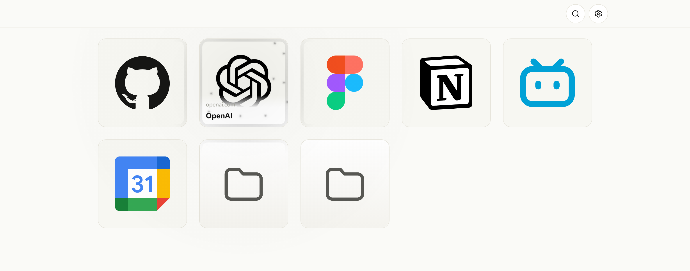

<p align="center">
  
</p>

MarkPad 会替换 Chrome 新标签页，并直接使用 Chrome 原生书签数据。它把传统书签树变成大尺寸卡片，让远程平板、触控屏、鼠标和键盘都能快速抵达常用入口。

## 实际界面

卡片是第一视觉单位，图标本身就能认出入口；标题默认收起，指针悬停或键盘聚焦时才从卡片底部展开。下面的界面由当前仓库代码与隔离测试书签渲染，不包含真实用户数据。

<p align="center">
  
</p>

## 为什么是 MarkPad

### 大卡片，为低精度输入留出空间

书签和文件夹以卡片网格呈现。主要触控目标不小于 44px，长按与右键使用同一套操作菜单；键盘方向键、触控笔和鼠标也可以继续使用。

标题和域名默认不显示，卡片保持正方形；指针悬停或键盘聚焦时文字面板从底部动画展开，盖在图标之上，卡片尺寸和网格位置都不变。触屏和手写笔没有悬停，第一次点按先展开文字，再点一次才打开书签。

### 指针经过时的卡片光效

鼠标或手写笔进入网格后，卡片边缘的描边光晕、跟随光标的柔光和点击涟漪会指出当前指向的卡片，贴近的卡片一起渐亮。颜色跟随亮色/暗色主题，不引入独立品牌色；触摸设备和系统「减少动效」下自动停用，退回静态边框反馈。

### 图标清晰，也允许手动纠正

默认图标优先从本地品牌库和通用工具图标库匹配，不再依赖启动时批量抓取 favicon。匹配不准时，可以查看带命中依据的本地候选、搜索 SVG，或上传宽高都不低于 256px 的位图。

### 数据仍是 Chrome 书签

MarkPad 直接读写 `chrome.bookmarks`，不会额外建立一套需要迁移和同步的书签数据库。打开方式和页面外观偏好保存在当前浏览器本地。

## 图标如何选择

<p align="center">
  
</p>

图标工坊把“自动匹配”和“手动选择”分开：自动匹配保持保守，手动候选则会展示标题、URL、域名、路径片段和具体命中依据。外部 SVG 搜索会标明来源，保存前统一经过 SVG 安全清理。

## 安装

本仓库提供加载已解压扩展的安装方式：

1. 下载或克隆本仓库。
2. 在 Chrome 打开 `chrome://extensions/`。
3. 开启右上角的「开发者模式」。
4. 点击「加载已解压的扩展程序」，选择仓库根目录。
5. 打开新标签页，开始使用 MarkPad。

修改代码后，需要回到 `chrome://extensions/` 刷新扩展。

## 常用操作

| 按键或手势 | 操作 |
| --- | --- |
| 点击 / 触控 | 打开书签或进入文件夹 |
| 右键 / 长按 | 打开卡片操作菜单 |
| `N` / `Shift+N` | 新建书签 / 文件夹 |
| `/` / `Ctrl+F` | 全局搜索书签和文件夹 |
| `Backspace` / `Alt+←` | 返回上级 |
| `↑` `↓` `←` `→` | 在卡片之间导航 |
| `Enter` | 打开当前选中项 |
| `F2` | 重命名选中项 |
| `Delete` | 删除选中项 |
| `Ctrl+Click` | 多选 |
| `=` / `-` | 放大 / 缩小卡片 |
| `Escape` | 关闭弹窗或工具面板 |

## 设置与个性化

- 新建、编辑、移动和删除书签或文件夹。
- 主题：浅色和深色两种模式，深色统一使用中性深灰，卡片只比背景亮一阶。
- 书签卡片：调整卡片尺寸和背景强度；标题与域名默认收起，悬停或键盘聚焦时才展开；尺寸滑块与 `=` / `-` 快捷键保持同步。
- 顶部栏：调整导航和工具按钮背后的背景强度。
- 打开行为：选择在新标签页或当前页打开书签。
- 通过 `/` 或 `Ctrl+F` 打开全局模糊搜索。
- 为单个书签重新匹配默认图标、应用本地候选、搜索 SVG 或上传高清位图。

## 版本

当前版本：`0.1.0`

`0.1.0` 建立了 MarkPad 的卡片式书签、顶部工具栏、快速搜索、图标工坊和外观偏好。未发布变更与完整版本历史见 [完整变更记录](CHANGELOG.md)。

## 权限

| 权限 | 用途 |
| --- | --- |
| `bookmarks` | 读取、创建、编辑、移动和删除 Chrome 书签 |
| `storage` | 保存自定义图标、解析缓存和本地偏好 |
| `favicon` | 显示网站图标预览并兼容历史 favicon 数据 |
| `tabs` | 控制书签打开方式并复用 iconfont 辅助页面 |
| `scripting` | 从与当前关键词匹配的 iconfont 搜索页提取 SVG |

## 开发

MarkPad 使用原生 JavaScript、按模块拆分的 CSS 和 Chrome Extensions Manifest V3。扩展运行没有构建步骤；唯一的运行时第三方文件是内置的 `vendor/gsap.min.js`（卡片光效动画），npm 依赖只用于生成本地图标数据、内置 gsap 和执行测试。

```text
MarkPad/
├── assets/           README 展示资源
├── components/       UI 组件
├── core/             书签数据、路由、事件和图标解析
│   └── icons/        图标匹配、清理、存储和生成数据
├── css/              样式入口与模块
├── docs/             品牌和专题设计文档
├── icons/            扩展图标与导出工具
├── scripts/          图标数据与 vendor 文件的生成脚本
├── tests/            轻量 Node 行为测试
├── vendor/           内置的第三方运行时文件（gsap）
├── index.html        新标签页入口
├── main.js           应用装配与全局交互
└── manifest.json     Chrome 扩展清单
```

常用验证命令：

```powershell
npm test
node --check main.js
node --test tests\version-system.test.mjs
npm run vendor:gsap
node -e "JSON.parse(require('fs').readFileSync('manifest.json', 'utf8'))"
git diff --check
```

涉及触控、弹窗、拖拽、图标工坊或 Chrome API 的修改，还需要在 `chrome://extensions/` 刷新扩展后进行运行态验证。维护规则和模块职责见 [AGENTS.md](AGENTS.md)，品牌方向见 [MarkPad Brand Visual Guide](docs/markpad-brand-visual-guide.md)。
